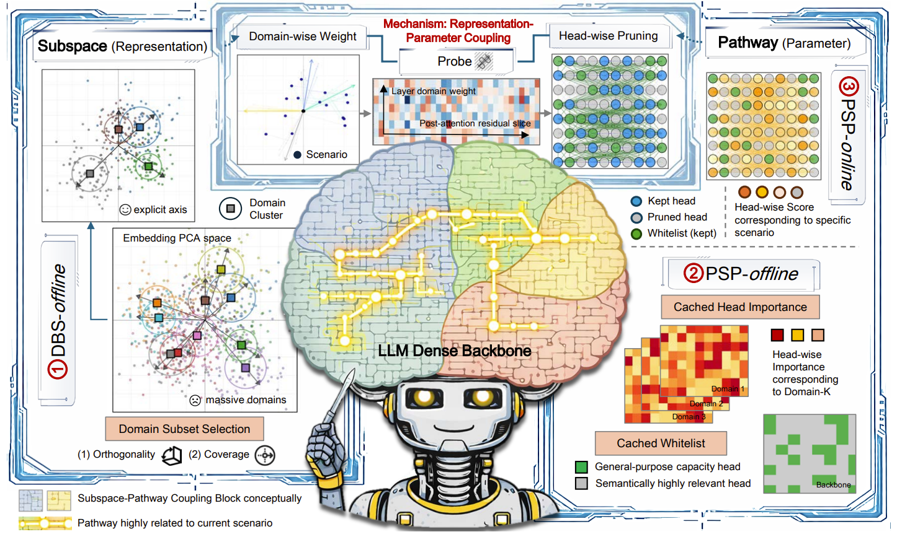

<div align="center">

# SubspacePath Pruner

### Inference-Time, Training-Free Structured Pruning via Probe-Based Representation–Parameter Coupling

**SubspacePath Pruner compiles a scenario-specific pruned subnetwork of a frozen
LLM at inference time — no fine-tuning, no gradient updates, no scenario training
data — by mapping a scenario's domain mixture onto the attention heads that matter.**

<p align="center">
  <a href="https://gongzhiren.github.io/personal-website/"><strong>Zhiren Gong</strong></a>, Yikun Hou, Fan Wu, Che Wang, Fuyao Zhang, Tiantong Wu, Yurong Hao, Jiaming Zhang, Yiyang Duan, Tiantong Wang, Fei Huang, Chau Yuen, Wei Yang Bryan Lim
</p>

<table>
  <tr>
    <td align="center">
      <a href="https://openreview.net/forum?id=fvkCjFvWKf"><strong>📄 Read the paper</strong></a><br>
      <sub>ICML 2026 · method &amp; results</sub>
    </td>
    <td align="center">
      <a href="https://gongzhiren.github.io/SubspacePathPruner-website/"><strong>🌐 Explore the project</strong></a><br>
      <sub>Visual story and highlights</sub>
    </td>
    <td align="center">
      <a href="#quick-start--pruned-inference"><strong>⚡ Quick start</strong></a><br>
      <sub>Pruned inference out of the box</sub>
    </td>
    <td align="center">
      <a href="#pretrained-artifacts"><strong>🧩 Use the artifacts</strong></a><br>
      <sub>Shipped probes for 4 models</sub>
    </td>
  </tr>
</table>

[](https://openreview.net/forum?id=fvkCjFvWKf)
[](https://openreview.net/forum?id=fvkCjFvWKf)
[](https://www.python.org)
[](https://pytorch.org)
[](LICENSE)

[Why](#why-subspacepath-pruner) · [Method](#method) · [Quick start](#quick-start--pruned-inference) · [Offline stage](#reproduce-the-offline-stage) · [Artifacts](#pretrained-artifacts) · [Citation](#citation)

</div>

<p align="center">
  
</p>

<p align="center"><em>Representation subspaces that align with semantic domains are coupled with sparse, reusable attention-head pathways — lightweight probes map a scenario onto the heads it needs and prune the rest under a budget.</em></p>

## News

- **2026 — ICML release.** Pretrained probe / importance / whitelist artifacts for
  four models, an out-of-the-box pruned-inference runner, and the full offline
  training pipeline.

## Why SubspacePath Pruner?

Structured pruning usually needs fine-tuning or scenario-specific training data.
SubspacePath Pruner needs neither. It rests on one observation: representation
subspaces that align with semantic **domains** in embedding space are coupled with
sparse, reusable **attention-head pathways** in parameter space. A handful of
lightweight linear probes, trained once offline, map a scenario's domain mixture
onto the heads that matter and prune the rest under a budget — so the pruned model
is just a structured head mask over the original frozen weights.

<table>
  <tr>
    <td align="center"><strong>Training-free</strong><br><sub>no fine-tuning, no gradients</sub></td>
    <td align="center"><strong>Inference-time</strong><br><sub>per-scenario mask, reused every turn</sub></td>
    <td align="center"><strong>4 models</strong><br><sub>Qwen2.5-7B/14B · Llama-3.1-8B · Llama-2-13B</sub></td>
    <td align="center"><strong>~tens of ms</strong><br><sub>scenario compilation cost</sub></td>
  </tr>
</table>

The released code lets you **run pruned inference out of the box** using the shipped
artifacts, and **reproduce the offline stage** (probe training → calibration → head
importance → whitelist) on your own model with the included input pools.

## Method

Two components run **offline once**; the online stage is a pure compilation step.

### DBS — Domain-Basis Synthesis (offline)

A compact set of quasi-orthogonal **domain axes** is constructed in embedding space as
a stable coordinate system. In this release the domains are pre-selected, so the axes
reduce to a one-hot basis over the selected domains
(`src/preorientation/domain_axes.py`) — you do **not** need to re-run domain selection.

### PSP — Probe-based Scenario Pruning

**Offline (model stays frozen):**

1. **Layer-wise linear probes** — for each layer ℓ and domain *k*, a 1-vs-rest probe
   scores domain relevance on the post-attention residual stream; only the probes are
   trained (`src/preorientation/linear_probe.py`).
2. **Temperature calibration** — probe logits are calibrated for single-domain, OOD,
   and cross-domain regimes (`src/preorientation/probe_calibration.py`).
3. **Axis-aligned head importance** `I_{ℓ,h,k}` — the expected squared projection of
   each head's residual write onto domain axis *k*:

   ```
   I_{ℓ,h,k} = E_{x ~ P_k} [ (u_k^T w̃_{ℓ,h}(x))^2 / (||w̃_{ℓ,h}(x)||^2 + ε) ]
   ```
   (`src/probe/head_importance.py`)
4. **Whitelist** — domain-invariant "backbone" heads (low importance variance across
   domains, high mean importance, confirmed by a statistical test) that are always
   kept (`src/probe/whitelist_identification.py`).

**Online (per scenario, training-free):**

1. **Diagnose** the scenario's domain mixture from the first turn(s) and compute a
   normalized-entropy **scenario breadth** `c(s) ∈ [0,1]` (`src/probe/domain_inference.py`).
2. **Score** each head: `score_{ℓ,h}(s) = Σ_k s_k^eff · I_{ℓ,h,k}`.
3. **Compile** a binary head-pruning mask under a budget set by `pruning_strength`,
   always keeping the whitelist, and **reuse the same mask for every turn** — zero
   per-turn overhead (`src/probe/session_pruning.py`).

Because nothing is optimized online, scenario compilation takes tens of milliseconds.

## Installation

```bash
git clone https://github.com/GongZhiren/SubspacePathPruner.git subspacepath-pruner
cd subspacepath-pruner
python -m venv .venv && source .venv/bin/activate
pip install -r requirements.txt
```

Tested with Python 3.10+, PyTorch ≥ 2.0, Transformers ≥ 4.40, on a single CUDA GPU.

**Models are not bundled.** Download the HuggingFace weights and place them under `models/`:

```
models/Qwen2.5-7B-Instruct/
models/llama-3.1-8b/
models/Qwen14B/                  # Qwen2.5-14B-Instruct
models/Llama-2-13b-chat-hf/
```

## Quick start — pruned inference

The offline artifacts for the four models already ship in
`outputs/<model>/ppd_pipeline/`, so pruned inference runs immediately:

```bash
python scripts/run_inference.py \
    --model Qwen2.5-7B-Instruct \
    --gpu 0 \
    --pruning_strengths 0.2 0.4 0.6 \
    --num_samples 20
```

This loads the probes, head importance and whitelist, sweeps the requested pruning
strengths over a 20-scenario sample from each test category, and prints accuracy vs.
average pruned-head fraction. Results are written to `outputs/<model>/pruning_strength/`.

| Flag | Default | Meaning |
|------|---------|---------|
| `--model` | `Qwen2.5-7B-Instruct` | directory name under `models/` |
| `--pruning_strengths` | `0.2 0.4 0.6` | strengths to sweep (higher → more pruning) |
| `--datasets` | `selected_domain out_of_domain cross_domain` | which `data/test/*` categories to run |
| `--num_samples` | `20` | scenarios sampled per category (`-1` = all) |
| `--use_history` | `false` | include previous turns as context |
| `--use_calibration` | `false` | use the temperature-calibrated probe system |

To also evaluate the cross-dataset splits, add e.g.
`--datasets selected_domain out_of_domain cross_domain commonsenseqa natural_questions arc`.

### Reproducing the paper results

The defaults above are tuned for a quick first run. For the full experiment, evaluate
the **entire** test set over the full pruning-strength sweep:

```bash
python scripts/run_inference.py \
    --model Qwen2.5-7B-Instruct --gpu 0 \
    --datasets selected_domain out_of_domain cross_domain \
    --num_samples -1 \
    --pruning_strengths 0.1 0.2 0.3 0.4 0.5 0.6 0.7 0.8
```

Repeat with the cross-dataset categories (`commonsenseqa natural_questions arc`) and
swap `--model` for `Qwen14B`, `llama-3.1-8b`, or `Llama-2-13b-chat-hf` for the other
models. Accuracy is the exact-match score described under *Evaluation protocol*.

## Reproduce the offline stage

To regenerate the artifacts for a model from the included input pools:

```bash
python scripts/train_offline.py \
    --model Qwen2.5-7B-Instruct \
    --gpu 0 \
    --selected_domains chemistry finance history math philosophy technology \
    --final_probe_epochs 20
```

Steps (base model stays **frozen**): train layer-wise probes → temperature-calibrate
(4-probe system) → compute axis-aligned head importance `I_{ℓ,h,k}` → identify the
domain-invariant whitelist. Outputs land in `outputs/<model>/ppd_pipeline/`
(`probe1_base.pt`, `probe_temperatures.json`, `calibration/`, `head_importance.pt`,
`whitelist.json`) — exactly the files `run_inference.py` consumes.

> `--head_importance single` (default) computes one importance set from the base probe
> and is fast; `--head_importance multi` computes scenario-specific sets and uses the
> cross-domain one. The pruner is **index-based**, so domain *names* never affect
> inference — they only label the probe indices.

## Data

All data ships with the repository.

- **`data/train/`, `data/val/`** — input-only pools, one JSON per selected domain
  (`chemistry, finance, history, math, philosophy, technology`); no labels needed.
- **`data/test/`** — multi-turn evaluation scenarios, each with a `topic_description`
  and `turns` (`prompt`, `answer`, `task_type` ∈ `multiple_choice` / `factual` / `code`
  / `reasoning`). Categories: `selected_domain/`, `out_of_domain/`, `cross_domain/`,
  and the cross-dataset splits `commonsenseqa/`, `natural_questions/`, `arc/`.

## Pretrained artifacts

`outputs/<model>/ppd_pipeline/` ships, for each of the four models:

| File | Contents |
|------|----------|
| `probe1_base.pt` | trained layer-wise linear probes (base probe) |
| `final_probes.pt` | probes from the final training pass |
| `probe_temperatures.json` | per-regime / per-layer temperature-scaling parameters |
| `calibration/` | cross-dataset calibration temperatures |
| `head_importance.pt` | axis-aligned head importance `I_{ℓ,h,k}` |
| `whitelist.json` | list of always-kept `(layer, head)` pairs |

These are the only learned parameters (a few MB per model); the base weights are never modified.

## Evaluation protocol

Answer accuracy is **exact-match (EM) keyword overlap**: after stopword removal, the
fraction of the expected answer's keywords matched by the prediction (for
multiple-choice, the extracted option letter must match exactly). There is **no
semantic-similarity scoring and no LLM judge** — see `src/evaluation/answer_evaluator.py`.

## Notes

- Single-GPU by design; select the device with `--gpu`. For large models, load with
  `--quantization int4` in `train_offline.py`.
- History (multi-turn context) is **off by default**; enable with `--use_history true`.
- `peft` is only needed if your base model path is a LoRA/PEFT adapter (optional).

## Citation

```bibtex
@inproceedings{gong2026subspacepath,
  title     = {SubspacePath Pruner: Inference-time Pruning via Probe-based Representation-Parameter Coupling},
  author    = {Gong, Zhiren and Hou, Yikun and Wu, Fan and Wang, Che and Zhang, Fuyao and Wu, Tiantong and Hao, Yurong and Zhang, Jiaming and Duan, Yiyang and Wang, Tiantong and Huang, Fei and Yuen, Chau and Lim, Wei Yang Bryan},
  booktitle = {Forty-third International Conference on Machine Learning},
  year      = {2026},
  url       = {https://openreview.net/forum?id=fvkCjFvWKf}
}
```

## License

Released under the MIT License — see [LICENSE](LICENSE).
